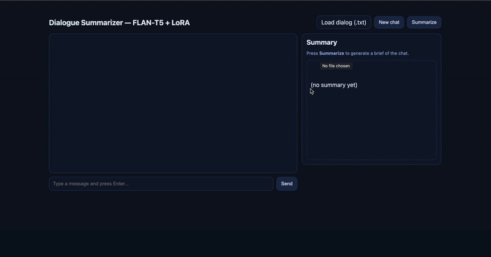

# Dialogue Summarizer — FLAN‑T5 + LoRA (car topics)

#### This project aims to analyze dialogue both in real time and with dialogue reconstruction from a text file to obtain the main semantic points of the dialogue.

## Quickstart
pip install -r requirements.txt

### Manual training
python train_lora_manual.py   --base_model google/flan-t5-base   --output_dir artifacts/flan_t5_base_lora_dialogsum_car   --topics "car,auto,vehicle,driver,parking,traffic"   --max_train_samples 1200   --max_val_samples 200   --num_epochs 2   --batch_size 8

### Serve the app
python app.py --host 127.0.0.1 --port 8000   --base_model google/flan-t5-base   --lora_dir artifacts/flan_t5_base_lora_dialogsum_car

### Additional experiments
In the following repo there are different jupyter notebooks with methods such as prompt engineering, full-fine tuning, and fine-tuning with LoRA:

https://github.com/stDem/Generative-AI-with-LLMs
